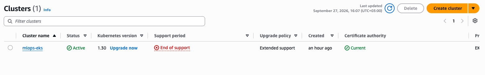
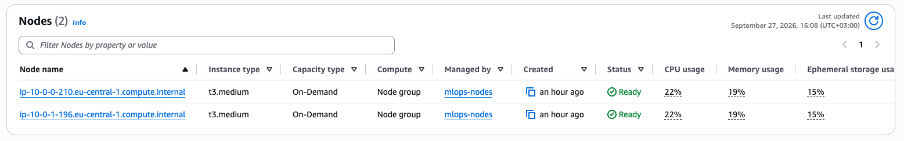
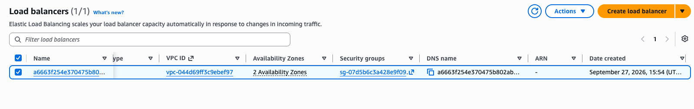
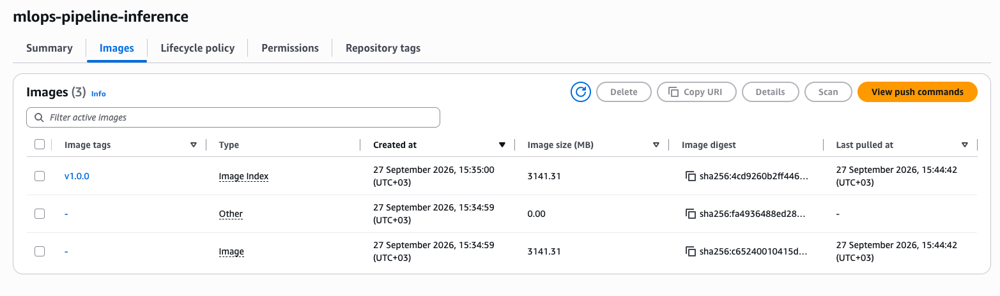
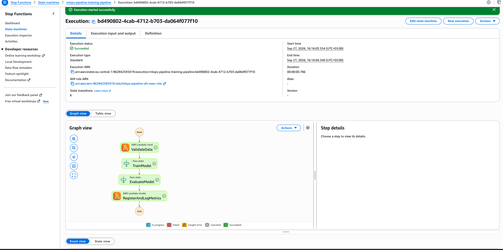
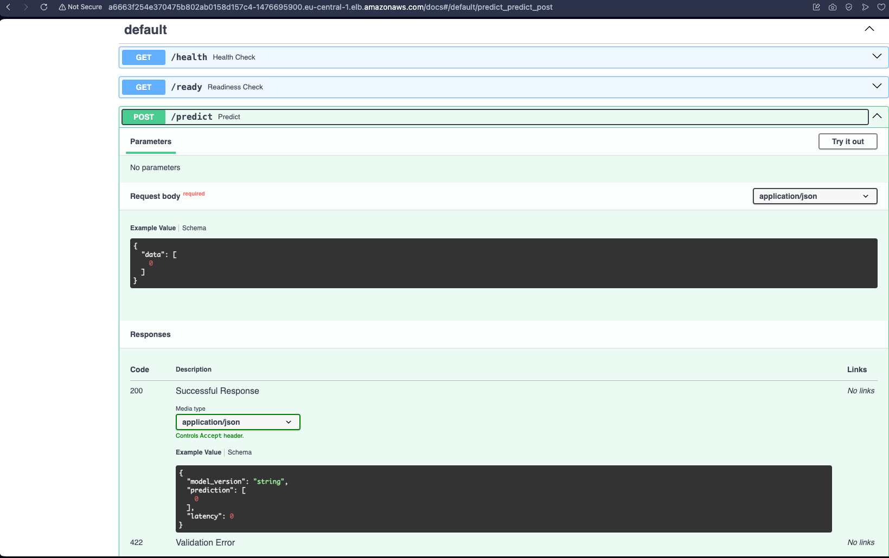
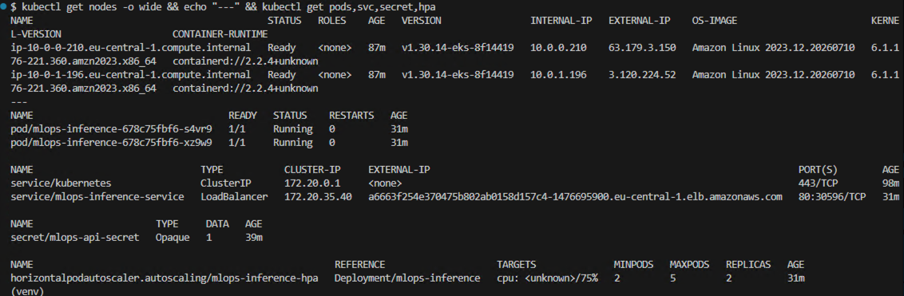
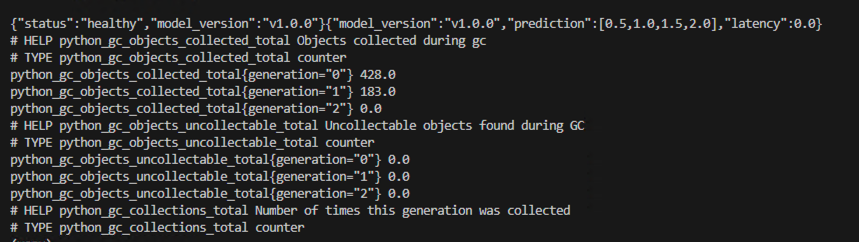
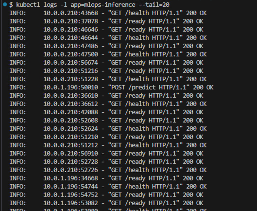

# MLOps Pipeline & Cloud Deployment Project

Повнофункціональний MLOps-пайплайн для автоматизованого тренування, валідації та продуктивного розгортання моделей машинного навчання в інфраструктурі AWS (EKS, Step Functions, ECR, Terraform).

---

## 1. Архітектура рішення

Проєкт побудований на принципах Infrastructure as Code (IaC) та GitOps:

1. **Training & Validation Pipeline**: Оркестрація процесів валідації даних, тренування та реєстрації метрик через **AWS Step Functions** та **AWS Lambda** (`ValidateData` $\to$ `TrainModel` $\to$ `EvaluateModel` $\to$ `RegisterAndLogMetrics`).
2. **Container Registry**: Збереження версіонованих Docker-образів сервісу інференсу в **Amazon ECR** (`mlops-pipeline-inference:v1.0.0`).
3. **Inference Service**: Мікросервіс на **FastAPI**, що забезпечує низьку затримку прогнозування, валідацію вхідних даних через Pydantic, захист за API-токеном та експорт метрик для Prometheus.
4. **Cloud Infrastructure & Orchestration**:
   - Кластер **Amazon EKS** (Kubernetes v1.30) на базі `AL2023_x86_64_STANDARD`.
   - Керування секретами за допомогою **Kubernetes Secret** (`mlops-api-secret`).
   - Автомасштабування через **Horizontal Pod Autoscaler (HPA)**.
   - Балансування навантаження та зовнішній доступ через **AWS LoadBalancer (ELB)**.

---

## 2. Структура репозиторію

```text
├── terraform/                # IaC-маніфести для AWS (EKS, VPC, IAM, Step Functions, ECR)
├── src/                      # Вихідний код інференс-сервісу та пайплайну
├── k8s/                      # Kubernetes-конфігурації (Kustomize)
│   ├── base/
│   │   ├── deployment.yaml   # Опис деплойменту та лімітів ресурсів
│   │   ├── service.yaml      # AWS LoadBalancer маніфест
│   │   ├── secret.yaml       # K8s Secret для API-ключа
│   │   └── hpa.yaml          # Horizontal Pod Autoscaler
│   └── overlays/
│       └── production/       # Оверлеї для продуктивного середовища
├── Dockerfile                # Оптимізована багатоетапна збірка образу
└── README.md                 # Документація проєкту
3. Розгортання інфраструктури та сервісів
3.1. Ініціалізація інфраструктури (Terraform)
Bash
cd terraform
terraform init
terraform plan
terraform apply -auto-approve
3.2. Налаштування доступу до кластера
Bash
aws eks update-kubeconfig --region eu-central-1 --name mlops-eks
kubectl get nodes -o wide
3.3. Публікація Docker-образу в ECR
Bash
aws ecr get-login-password --region eu-central-1 | docker login --username AWS --password-stdin 962942593419.dkr.ecr.eu-central-1.amazonaws.com
docker tag mlops-inference:v1.0.0 [962942593419.dkr.ecr.eu-central-1.amazonaws.com/mlops-pipeline-inference:v1.0.0](https://962942593419.dkr.ecr.eu-central-1.amazonaws.com/mlops-pipeline-inference:v1.0.0)
docker push [962942593419.dkr.ecr.eu-central-1.amazonaws.com/mlops-pipeline-inference:v1.0.0](https://962942593419.dkr.ecr.eu-central-1.amazonaws.com/mlops-pipeline-inference:v1.0.0)
3.4. Розгортання в Kubernetes
Bash
kubectl apply -f k8s/base/
kubectl patch svc mlops-inference-service -p '{"spec": {"type": "LoadBalancer"}}'
kubectl get svc mlops-inference-service -w
4. Верифікація та Smoke Testing
4.1. Перевірка статусу ресурсів
Plaintext
NAME                                  READY   STATUS    RESTARTS   AGE
pod/mlops-inference-678c75fbf6-s4vr9  1/1     Running   0          5m
pod/mlops-inference-678c75fbf6-xz9w9  1/1     Running   0          5m

NAME                              TYPE           EXTERNAL-IP                                                                   PORT(S)
service/mlops-inference-service   LoadBalancer   a6663f254e370475b802ab0158d157c4-1476695900.eu-central-1.elb.amazonaws.com   80:30596/TCP
4.2. Перевірка Healthcheck (GET /health)
Bash
curl -i http://<LOAD_BALANCER_URL>/health
HTTP
HTTP/1.1 200 OK
content-type: application/json

{"status":"healthy","model_version":"v1.0.0"}
4.3. Отримання передбачення (POST /predict)
Bash
curl -X POST "http://<LOAD_BALANCER_URL>/predict" \
  -H "Content-Type: application/json" \
  -H "X-API-KEY: mlops-super-secure-token-2026" \
  -d '{"data": [1.0, 2.0, 3.0, 4.0]}'
JSON
{
  "model_version": "v1.0.0",
  "prediction": [0.5, 1.0, 1.5, 2.0],
  "latency": 0.0
}
4.4. Моніторинг метрик (GET /metrics/)
Bash
curl -s http://<LOAD_BALANCER_URL>/metrics/ | head -n 10
Plaintext
# HELP python_gc_objects_collected_total Objects collected during gc
# TYPE python_gc_objects_collected_total counter
python_gc_objects_collected_total{generation="0"} 428.0
python_gc_objects_collected_total{generation="1"} 183.0
python_gc_objects_collected_total{generation="2"} 0.0
5. Безпека
Secret Management: Аутентифікаційні токени не зберігаються у відкритому тексті в репозиторії. Вони монтуються в контейнер із захищеного Kubernetes Secret через змінні оточення (API_KEY).

Least Privilege IAM: Всі ролі для EKS Node Group, Lambda та Step Functions мають чітко обмежені політики доступу.

Resource Constraints: Контейнери розгорнуті з чіткими лімітами resources.requests та resources.limits (CPU/Memory) для запобігання вичерпанню пам'яті ноди (OOMKilled).

6. Згортання ресурсів (Teardown)
Для уникнення додаткових витрат на ресурси AWS:

Bash
# 1. Видалення сервісу для звільнення AWS ELB
kubectl delete svc mlops-inference-service

# 2. Знищення інфраструктури через Terraform
cd terraform
terraform destroy -auto-approve

---

## 7. Підтвердження працездатності (Артефакти та скриншоти)

### 7.1. Хмарна інфраструктура (AWS Management Console)

- **EKS Cluster (статус Active):**
  

- **EKS Worker Nodes (t3.medium у статусі Ready):**
  

- **AWS Load Balancer (ELB для зовнішнього доступу):**
  

- **Amazon ECR (версіонований образ mlops-pipeline-inference:v1.0.0):**
  

---

### 7.2. Training & Validation Pipeline (AWS Step Functions)

- **Успішне виконання стейт-машини тренування (Succeeded):**
  

---

### 7.3. Інференс-сервіс, Smoke Testing та Безпека

- **Інтерактивна документація FastAPI (Swagger UI):**
  

- **Стан Kubernetes ресурсів (Nodes, Pods, LoadBalancer Service, Secret, HPA):**
  

- **Результати виконання запитів (/health, /predict із токеном, /metrics/):**
  

- **Логи обробки трафіку сервісом (HTTP 200 OK):**
  