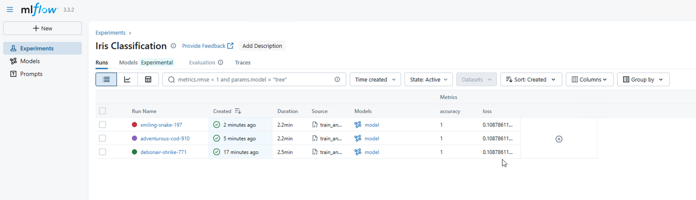
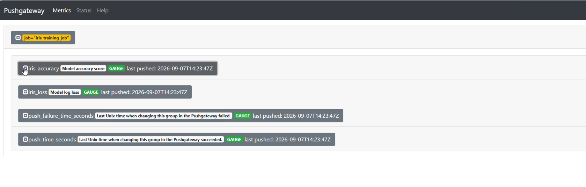
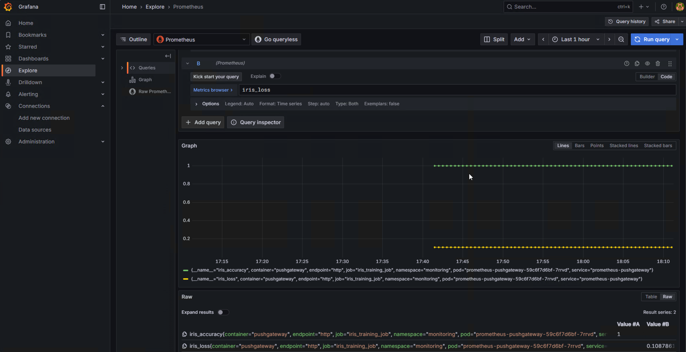

1. Запуск 4 YAML-маніфестів інфраструктури
У терміналі VS Code застосовуємо 4 маніфести компонентів у кластер:

Bash
kubectl apply -f minio.yml
kubectl apply -f mlflow.yml
kubectl apply -f pushgateway.yml
kubectl apply -f prometheus-stack.yml
Перевіряємо, що всі поди успішно перейшли в статус Running:

Bash
kubectl get pods -A

2. Створення ServiceMonitor для Pushgateway
Оскільки Pushgateway працює в просторі імен monitoring, а Prometheus Operator — у infra-tools, створюємо ServiceMonitor із honorLabels: true, щоб Prometheus автоматично забирав метрики моделі:

Bash
cat <<EOF | kubectl apply -f -
apiVersion: monitoring.coreos.com/v1
kind: ServiceMonitor
metadata:
  name: prometheus-pushgateway
  namespace: infra-tools
  labels:
    release: prometheus-operator
spec:
  namespaceSelector:
    matchNames:
      - monitoring
  selector:
    matchLabels:
      app.kubernetes.io/name: prometheus-pushgateway
  endpoints:
    - port: http
      interval: 10s
      scrapeTimeout: 10s
      honorLabels: true
EOF

3. Прокидання портів до сервісів (Port-Forwarding)
У розділених терміналах VS Code запускаємо тунелі до сервісів:

Термінал 1 (MLflow UI):

Bash
kubectl port-forward svc/mlflow 5000:5000 -n applications
Термінал 2 (MinIO API):

Bash
kubectl port-forward svc/minio 9000:9000 -n applications
Термінал 3 (Pushgateway):

Bash
kubectl port-forward svc/prometheus-pushgateway 9091:9091 -n monitoring
Термінал 4 (Grafana):

Bash
kubectl port-forward svc/prometheus-operator-grafana 3000:80 -n infra-tools
4. Налаштування оточення та запуск моделі
В окремому терміналі VS Code переходимо в папку експериментів, активуємо віртуальне оточення, задаємо змінні підключення до сервісів і запускаємо навчання моделі:

4. Налаштування оточення та запуск моделі
В окремому терміналі VS Code переходимо в папку експериментів, активуємо віртуальне оточення, задаємо змінні підключення до сервісів і запускаємо навчання моделі:

Bash
cd experiments
source venv/Scripts/activate

export MLFLOW_TRACKING_URI="http://localhost:5000"
export MLFLOW_S3_ENDPOINT_URL="http://localhost:9000"
export AWS_ACCESS_KEY_ID="minio"
export AWS_SECRET_ACCESS_KEY="minio123"
export PUSHGATEWAY_URL="localhost:9091"

python train_and_push.py
Скрипт навчає модель логістичної регресії на датасеті Iris, фіксує параметри й метрики в MLflow, завантажує артефакт моделі в бакет MinIO та відправляє фінальні метрики iris_accuracy і iris_loss у Prometheus Pushgateway під джобою iris_training_job.

📸 Підтвердження результатів
1. MLflow Tracking & Artifacts
Експеримент Iris Classification успішно зафіксував параметри (learning_rate, epochs), метрики (accuracy, loss) та зберіг саму модель в S3-сховище MinIO.

2. Prometheus Pushgateway
Метрики моделі iris_accuracy та iris_loss успішно надіслані та відображаються під задачею iris_training_job.

3. Grafana Explore
Prometheus автоматично зібрав метрики через створений ServiceMonitor, і вони успішно побудовані на графіках у Grafana Explore.

